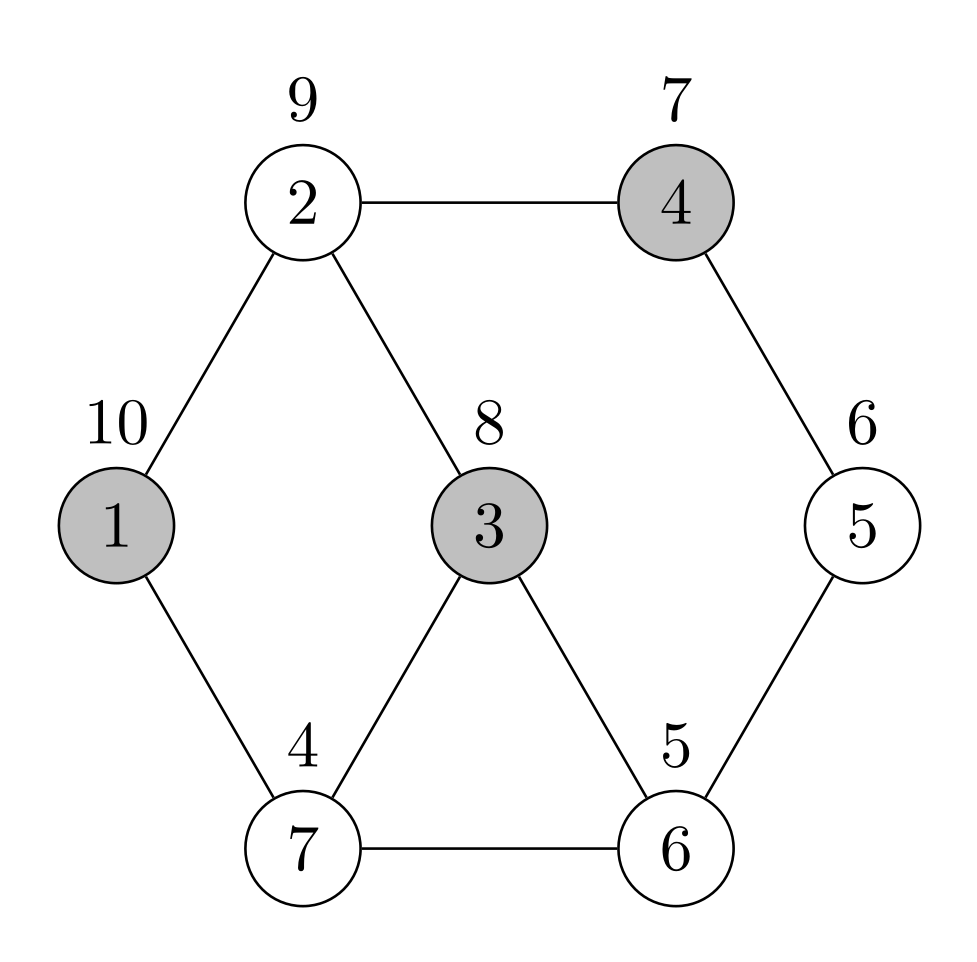
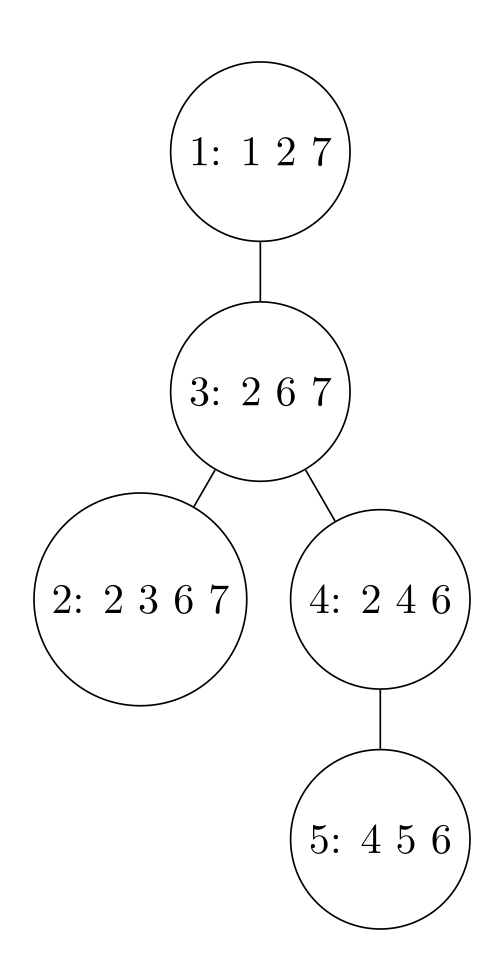

## Example

### Input Graph (`mytest.graph`) and Input Tree Decomposition(`mytest.td`)
<table>
<tr>
<td>
<strong>File: <code>data/test_set/mytest.graph</code></strong>
<pre>
7 9 10
10 2 7
9 1 3 4
8 2 6 7
7 2 5
6 4 6
5 3 5 7
4 1 3 6
</pre>
</td>
<td>
<strong>File: <code>data/test_set/mytest.td</code></strong>
<pre>
s td 5 4 7
b 1 1 2 7
b 2 2 3 6 7
b 3 2 6 7
b 4 2 4 6
b 5 4 5 6
1 3
2 3
3 4
4 5
</pre>
</td>
</tr>
<tr>
<td>

</td>
<td>

</td>
</tr>
</table>


## Output Format

```
25
0.00047671
1 3 4 
```